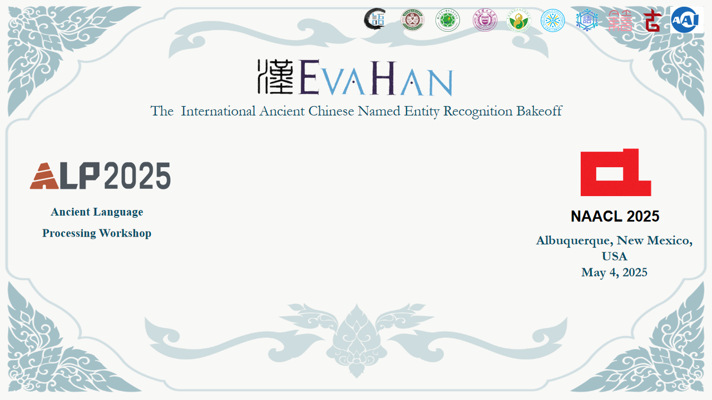

# EvaCun2025
 The code implementation for the article "Simple Named Entity Recognition (NER) System with RoBERTa for Ancient Chinese". 

 The link for this paper is [https://aclanthology.org/2025.alp-1.27.pdf](https://aclanthology.org/2025.alp-1.27.pdf)

# Code

## Dataset

ALP EvaCun2025

## Data Extraction

data.ipynb

## Training

data.ipynb处理完后运行EvaNer.ipynb(softmax实现)或EvaNer_crf.ipynb(crf实现)

# Poster (EvaCun2025)
